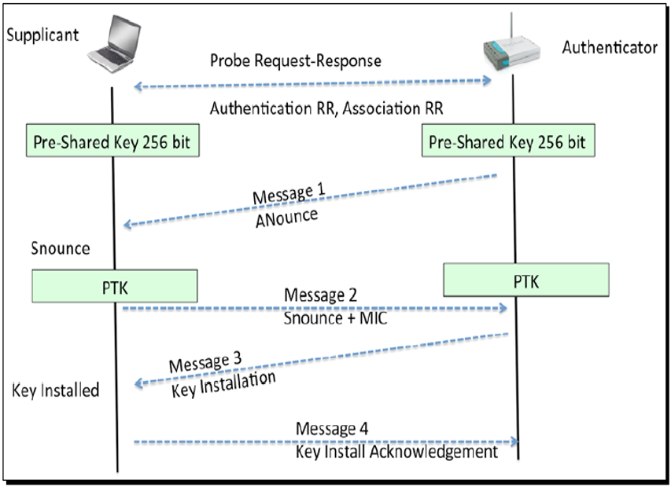
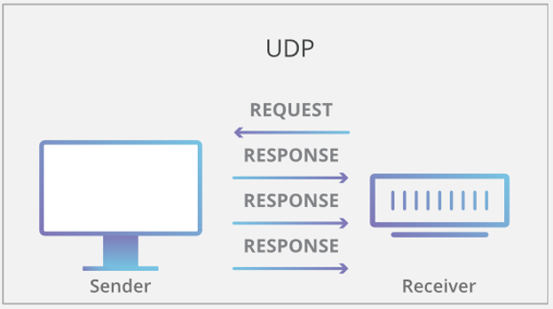

<h1> Abstract </h1>
	The beginning of the semester involved familiarization with Kali Linux and the Wireshark sections of the course book. Namely, the team practiced skills for sniffing network traffic and collecting data packets. Then, the team collected data packets from three types of drones - the Intel, the Sky Viper, and the 3DR Solo. The purpose was to detect unique message patterns in order to adequately profile each drone solely based on the message traffic collected. With the data packet files in hand, the team built python scripts that analyzed the MAVLink message IDs/payloads and then organized the information into spreadsheets and graphs to begin building profiles for these drones. Although multiple drones operate using MAVLINK software, their message traffic varied based on programming and the physical components present on the drones. After multiple data-collecting trials, individual heartbeat patterns were detected, but more data is required to build more accurate profiles.
  
# Introduction
	Drone traffic profiling and protocol reverse engineering involves exploiting unmanned aircraft systems (UAS) and applications using open-source software and hardware to determine how message traffic correlates to physical components. Drones have become an effective tool for malicious users to surveil and deploy lethal payloads.  Due to this increasing threat, a new solution - drone traffic profiling, was implemented to adequately identify drones in an effort to stop malicious users. This drone traffic profiling project involves three steps.  The first step is to build a database of drone classifiers by breaking down their unique wireless protocols.  The second step is to accurately identify a flying drone by comparing its Wi-Fi message traffic patterns to the analyzed patterns stored in the database.  The third and final step is to land or disable the drone using predetermined artificial command injection. This project focused on the first and second steps.  
The rest of the report is organized as follows. Section 2 explains the different types of materials used such as hardware tools and software tools. Section 3 is the first step of this project which is becoming familiar with Kali Linux.  Section 4 is the steps taken in collecting the necessary data from the drone. Section 5 is an explanation of how our group analyzed the data from the drone. The conclusion is left in the last part. 

# 2 | Materials
The project involved a toolset consisting of both hardware and software. The materials are listed below. 
Hardware Tools:
•	Computers (laptops)
•	Routers (for learning Kali Linux)
•	Intel Aero Ready-to-Fly Drone
•	Sky Viper 1.0 Drone
•	Sky Viper 2.0 Drone
•	Solo Drone
•	LiPo Battery: ~400mAh, 4S (14.8V)
•	Kali Linux with external Wi-Fi card
Software Tools:
•	QGroundControl (QGC) - Intel Drone Companion Application for Computer
•	Sky Viper Drone Companion App for Mobile Phones
•	Solo Drone Companion App for Mobile Phones
•	Aircrack-ng and Wireshark
•	Python Scripts

# 3 | Process 1: Learning to Use Kali Linux
	The first step to this project was installing Kali Linux on a virtual machine and learning to sniff Wi-Fi packets.  Packet sniffing was achieved by putting a Wi-Fi card in monitor mode. While in monitor mode, the Wi-Fi card can surreptitiously observe (or ‘sniff’) the Wi-Fi data traffic being sent to and from a specified network. In other words, the network would not be able to detect or see the Wi-Fi card doing this. This technique involved sniffing all the networks in the vicinity and then specifying the correct ESSID (name of the network) or the BSSID (MAC address of the network) amongst the sniffed list of networks. By specifying the name of the network, it was possible to confirm that the ESSID was transmitting Wi-Fi traffic, as well as, which channel that network was operating on. The monitoring Wi-Fi card was then configured to monitor the same channel and Wireshark was used to observe/save the network traffic. The collected packets were filtered out using “UDP” as a filter, and the filtered data was exported as a (.json) file for easier processing. Python scripts were then used to extract relevant information from the (.json) file and build profiling spreadsheets.
  
# 4 | Process 2: Collecting Drone Data
	For the field exercises, the data-collector would have their Wi-Fi card in monitor mode while focusing on the channel and BSSID of the active drone. The drone network traffic is typically encrypted using WPA or WPA2 protocols. The WPA (Wi-Fi Protected Access) and WPA2 protocols are security protocols used to encrypt or mask message traffic between two points. Data collection could only begin if the data-collector (the sniffing computer used for collecting data packets) had obtained the WPA handshake, indicated by a message in Kali Linux. Having the WPA handshake for a particular network indicates that the sniffing computer has the decryption key necessary to exchange and decrypt information on the network.
In order to obtain the WPA handshake, power was cycled to the Wi-Fi connection between the drone and its controller (for the Solo and Sky Viper drones, this was executed through the drone’s mobile phone companion application) or between the drone and its computer application (this applied to the Intel drone only). The data-collector then observed the moment the Wi-Fi connection was reestablished in order to capture the one-time decryption key that is otherwise only shared between the drone and its respective controller/application. This process (the four-way handshake in WPA2) is shown in Figure 1. 

## Figure 1. WPA2 Four-Way Handshake.
	In other words, the data-collector (sniffing computer) would be spying on this interaction to see the decryption key that is passed between the supplicant (drone) and authenticator (access point). In Kali Linux, this event would notify the user that the handshake key was obtained and recording of Wi-Fi traffic would begin using Wireshark. Collection of data continued until 30,000 data packets were collected. 
  
# 5 | Process 3: Analyzing Drone Data
	For each trial, the collected drone data was recorded in a (.pcap) file, which was opened in the Wireshark application. After inputting the WPA password for that particular drone, the data was filtered so that only UDP (User Datagram Protocol) packets were exported to a (.json) file. The term UDP refers to a particular protocol for network communication (data transmission) wherein data packets are sent quickly and continuously by the sender (in our case, the drone) upon request for data (in our case, this occurs as soon as the drone and its controller are both powered on and are connected to each other). This interaction is shown in Figure 2.

## Figure 2. UDP Data Transmission.
	In other words, when the sender is preparing to send a data packet, the sender does not wait for the receiver (in our case, the drone’s controller) to send confirmation or a ready signal first; the sender will continuously send the data packets without hesitation once a handshake is established. The downsides of UDP include that the transmission may experience data loss. For example, data packets may be corrupted, lost (dropped), or duplicated. The upsides of UDP include that it is fast and efficient. 
The python scripts were then used to parse through the (.json) file and write the contents to a spreadsheet for easier reading. By analyzing these spreadsheets into sections categorized by MAVLINK Message IDs, message patterns within the traffic were found. For example, the Sky Viper was found to have a heartbeat message sent at a frequency of 1Hz and displayed a loop of message ID’s at a frequency of 4 Hz. The Intel drone, on the other hand, had two heartbeats. It was concluded that one heartbeat was from the drone and the other was from the controller. Both heartbeats had a frequency of 1Hz and were staggered by approximately .2 seconds. 

# Conclusion
The team was successfully able to capture packets from the Intel Aero drone, the Sky Viper 1.0 drone, but not the 3DR Solo drone. Packets from the Intel Aero Drone and the Sky Viper 1.0 drone were successfully analyzed using python scripts.  The appropriate UDP MAVLINK packets were not collected from the Solo drone. The lack of message traffic for this drone may have been a result of not having a Go-Pro camera attached to the Solo’s Gimbal. Because the Gimbal also uses MAVLINK commands to control the position of the camera, the lack of hardware may have caused an error in the transmission of MAVLINK commands. It is possible that the camera is controlled via Wi-Fi and that the drone itself is controlled via radio frequencies. Another possibility for the lack of message traffic could be that the Solo was configured to send traffic via TCP instead of UDP, which the team was not actively looking for. The team will continue to collect more data for these particular drones to establish more accurate profiles. 

# References
What is User Datagram Protocol (UDP/IP)? [Online]. Available: https://www.cloudflare.com/learning/ddos/glossary/user-datagram-protocol-udp/

