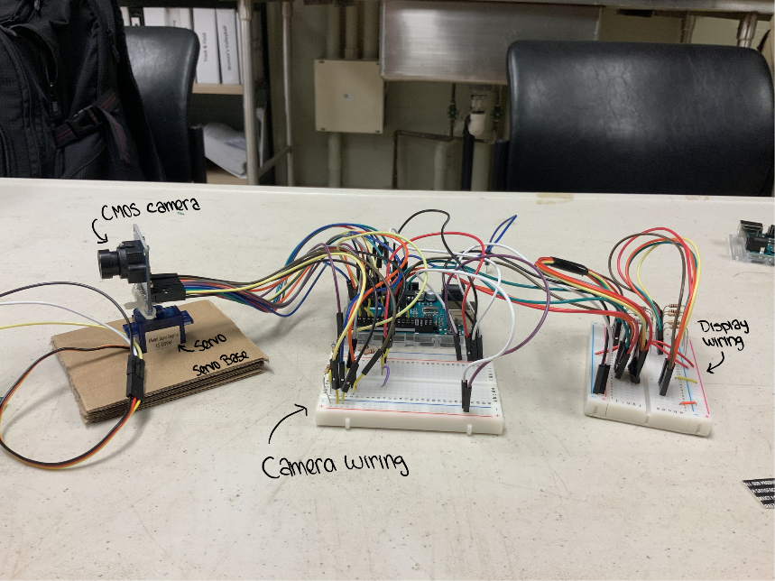
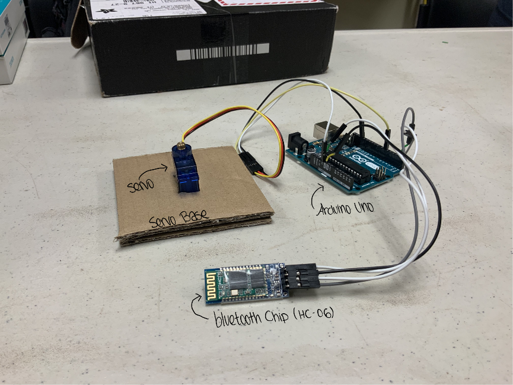

  
  

 
Our Motorcycle HUD project is designed to provide a universal drop-in HUD to increase a motorcyclist's field of view. At higher speeds, the drag force exerted on riders' helmets can be strong enough to torque the neck and cause muscle strains. The wind drag caused by turning the helmet into a less aerodynamic position can also cause the rider's bodyweight to shift, which will in turn cause the rider to drift into another lane position. The goal is to minimize the amount of time riders must spend turning their head when traveling at speed. 

The HUD system is composed of three subsystems. The first part is a wirelessly controlled servo-mounted camera that is to be placed on the back of the motorcycle. The servo will automatically pivot in the direction of the intended lane change when the rider turns on either turn signal. The second part of the system is the camera-display system. Our original prototype used long wires to connect the camera to a micro LCD display. However, the next version will have a wireless connection between the camera and display. The third subsystem is the optics component. This consists of two lenses and a glass pane positioned in such a way as to project a virtual image of the display without obstructing the rider's field of view. The magnification of the lenses were chosen so that the virtual image is large enough and far enough as to be seen without the rider having to refocus their eyes.

For this project, I was the lead programmer who was responsible for programming the Arduino controllers.  I started by programming the basics, such as wireless communication between devices and mapping the controls to the servo. The code used to supply camera feed to the display was sourced from open projects on GitHub. I was also in charge of calculating the optimal positioning of our optics. My partner, Keenan Lee, and I both contributed to the wiring and soldering of the electrical components.

